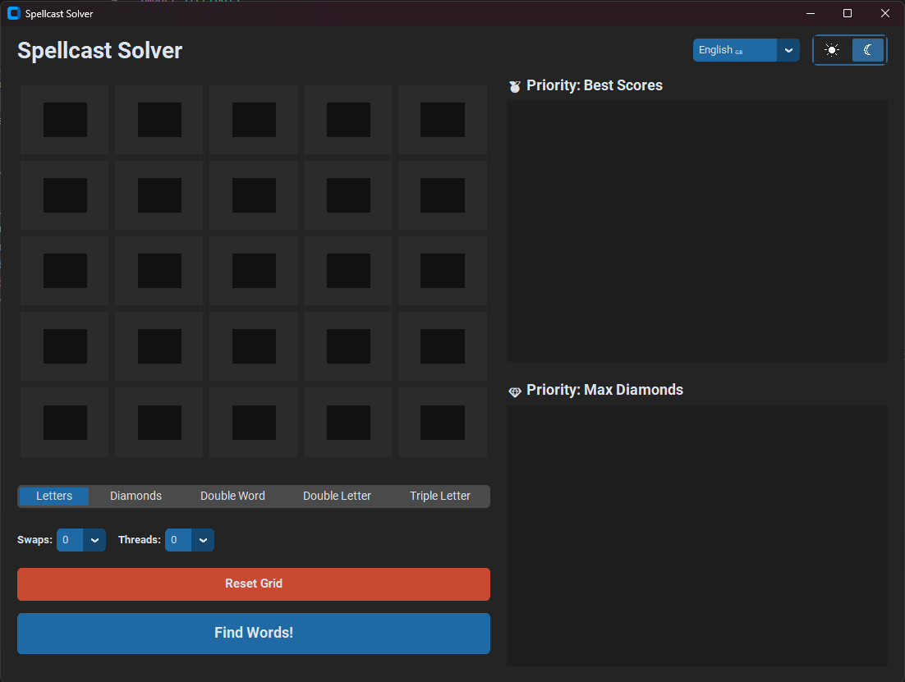
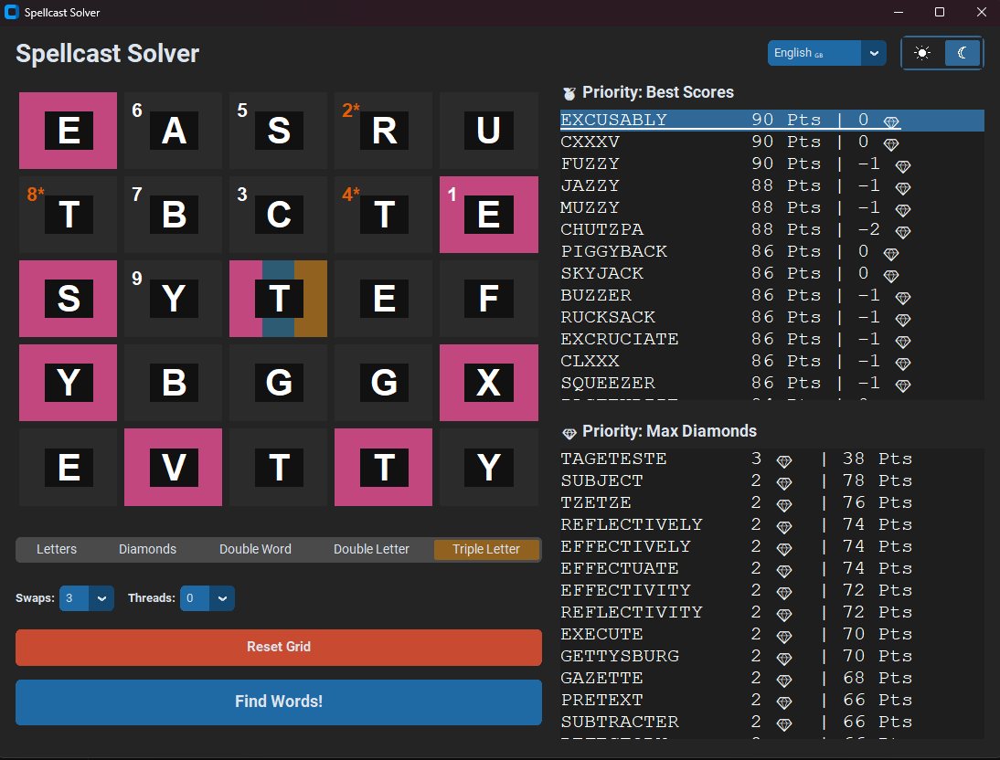
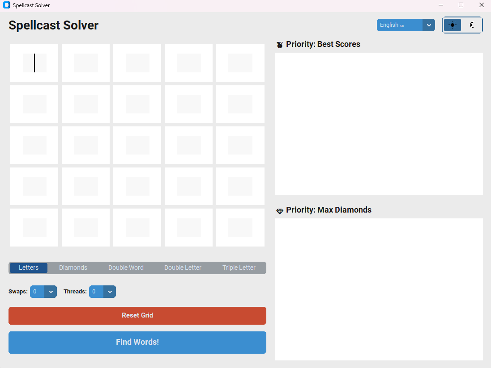
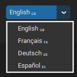

# Resolvedor de Spellcast

Un potente resolvedor desarrollado en Python con una interfaz gráfica moderna (`customtkinter`), **diseñado específicamente para la actividad de Discord "Spellcast"**. Ten en cuenta que este *no* es un resolvedor de Boggle de propósito general. ¡Este resolvedor te ayuda a encontrar las palabras con mayor puntuación en el tablero de Spellcast, teniendo en cuenta casillas especiales como Diamantes, Palabra Doble (DW), Letra Doble (DL), Letra Triple (TL) e incluso comodines de letras (swaps)!

## Capturas de pantalla

<p align="center">
  
  
</p>
<p align="center">
  
  
</p>

## Características
- **Cuadrícula interactiva 5x5**: Haz clic y escribe letras directamente en la interfaz intuitiva.
- **Anotaciones de casillas especiales**: Marca casillas específicas para Diamantes y Multiplicadores para calcular la puntuación máxima exacta.
- **Soporte de comodines (Swaps)**: Configura cuántos intercambios de letras están permitidos, y el resolvedor encontrará los caminos lógicos.
- **Búsqueda profunda multiproceso**: Utiliza todos los núcleos de tu CPU a través del multithreading de Python para acelerar el cálculo enormemente.
- **Rutas resaltadas**: Pasa el ratón sobre un resultado para ver su ruta ilustrada sobre la cuadrícula, o haz clic en él para bloquear la ruta permanentemente. ¡Una letra marcada con un asterisco `*` te indica que debe ser reemplazada con un comodín!
- **Modo oscuro/claro**: Preciosa interfaz dinámica con posibilidad de cambiar el idioma en tiempo real (Inglés, Francés, Alemán, Español).

## Instalación
1. Asegúrate de tener instalado **Python 3.10+**.
2. Se recomienda un entorno virtual:
   ```bash
   python -m venv .venv
   .\.venv\Scripts\activate  # Windows
   ```
3. Instala los requisitos requeridos:
   ```bash
   pip install -r requirements.txt
   ```

## Cómo usar el resolvedor
Inicia la ventana del programa:
```bash
python solver/main.py
```
Escribe tus letras en las cajitas, configura la posición de tus modificadores / diamantes o número de hilos con la barra inferior. Haz clic entonces en **"¡Buscar palabras!"**. 

## Licencia
Este proyecto está bajo la **Licencia MIT**. Eres libre de copiar, modificar, publicar, utilizar y distribuir libremente este software, siempre y cuando incluyas el aviso de derechos de autor original (citando al creador original). Consulta el archivo `LICENSE` para conocer más detalles.
